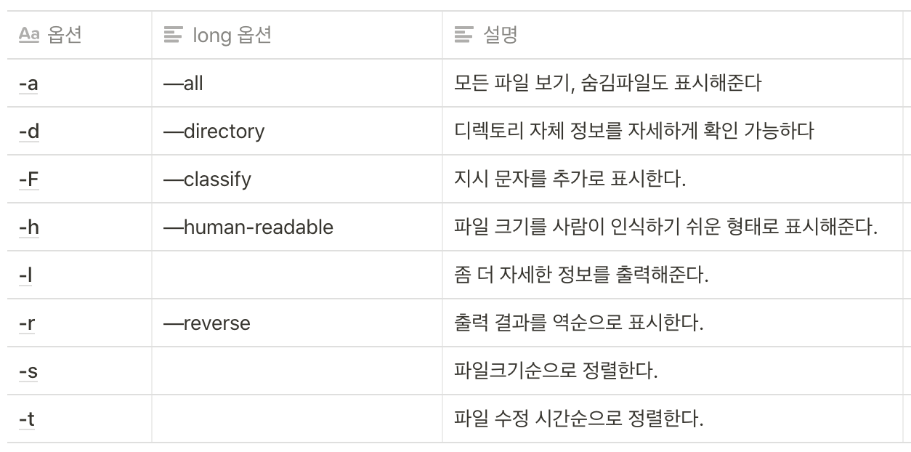
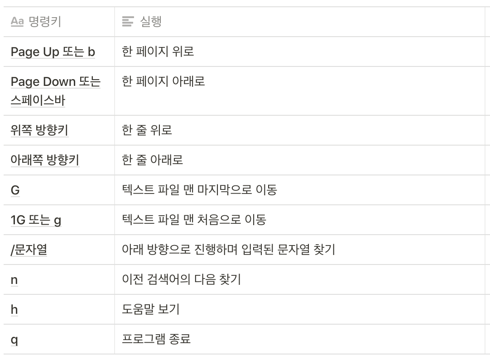
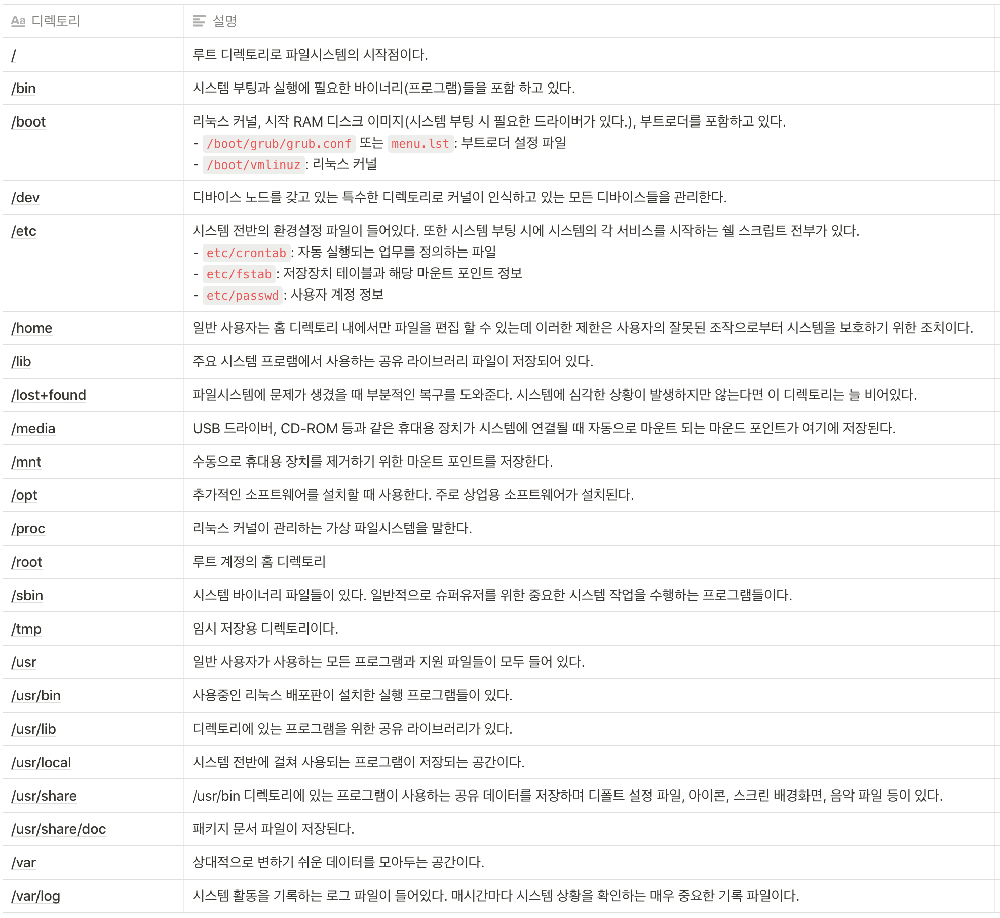

> 이 글은 윌리엄 E. 샤츠 주니어의 리눅스 커맨드라인 완벽 입문서 책을 정리한 글입니다.

```bash
$ ls # 디렉토리 내용 나열하기
$ file # 파일 타입 확인하기
$ less # 파일 내용 표시하기
```

## 재미있는 IS 명령어

디렉토리 목록을 볼 수 있고 중요 파일 및 디렉토리 속성을 결정할 때 유용하다.
현재 작업 디렉토리에 있는 파일과 하위 디렉토리들이 모두 표시된다.

```bash
# 현재 디렉토리
$ ls
# 다른 디렉토리 목록 조회, 여러개 조회할 경우 스페이스바로 분리하여 나열
$ ls /조회할 디렉토리명
# 속성 조회할 경우 -l 옵션 사용
$ ls -l
```

### 명령어 옵션과 명령 인자

`명령어 -옵션인자`

- 대부분 명령어를 입력하고 그 다음에 -(대시)와 함께 옵션을 명시한다.
- 많은 명령어들이 Long 옵션을 제공하는데 `—` 기호를 선행하여 쓴다.
- 여러 옵션을 한 명령어에 연이어 사용할 수 있다.

#### 주로 많이 사용되는 ls 옵션



### Long 포맷으로 출력 결과 보기

`-l` 옵션은 ls 명령어의 출력 결과를 long 포맷으로 바꿔준다.

```bash
[파일 접근 권한 정보] [하드 링크의 수] [파일 소유자의 사용자 이름] [파일을 소유한 그룹 이름] [파일 크기(바이트 단위)] [파일 마지막 수정 날짜와 시간] [파일명]
```

파일 접근 권한 정보(1333 형식으로 구성되어있다.)

- 1번째문자: 파일형식(`-`: 일반적인 파일, `d`: 디렉토리
- 2번째~4번째: 파일 소유자의 접근 권한 정보
- 5번째~7번째: 파일 그룹에 대한 권한 정보
- 8번째~10번째: 그 외 사용자에 대한 권한 정보

## file명령어로 파일 타입 확인

리눅스에서는 파일명이 해당 파일의 정보를 반영하고 있지 않다.

```bash
$ file filename
```

리눅스와 같은 유닉스형 운영체제에서는 "모두 다 파일이다"라는 기본적인 개념이 있다.

## less 명령어로 파일 정보 보기

less 명령어는 텍스트 파일을 볼 때 사용하는 프로그램이다.

**환경설정 파일**과 같이 시스템 환경을 정의하는 파일들은 대부분 텍스트 형식으로 저장되어 있으며, **스크립트**들도 텍스트 형식으로 저장된다.

**텍스트란?**

텍스트는 문자 하나에 숫자 하나를 대응하는 단순한 원리로 되어 있고 크기도 매우 작다.

```bash
$ less filename

# 시스템의 모든 사용자 계정 정보가 정의된 파일을 확인
$ less /etc/passwd
```

텍스트 파일을 스크롤하여 확인 할 수 있으며, 프로그램을 종료하려면 `Q` 키를 누르면 된다.

#### less 명령키



## 함께 탐험해보자!

리눅스의 파일시스템 배치 형식은 다른 유닉스형 시스템의 것과 매우 흡사한데 이러한 형식은 `리눅스 파일시스템 계층표준` 에 따라 설계되었다.

#### 리눅스 시스템 디렉토리



## 심볼릭 링크

원본 파일의 이름을 가르키는 링크다. 그러므로 원본 파일이 사라지게 되면 역할을 수행할 수 없다. 장점은 전혀 다른 파일이라도 원본 파일과 이름이 같다면 계속 사용 가능하다.
