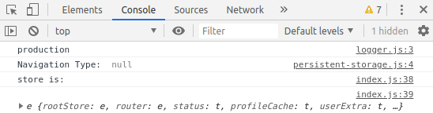

production일때 console.log()가 찍히는 현상 발견하여 검색하니 babel 설정에서 해결 가능하다는 것을 확인

(console.log()는 개발시 확인용도이며 성능상으로도 속도에 영향을 주기 때문에 없애줘야한다.)



babel plugin 설치

```bash
npm install babel-plugin-transform-remove-console --save -dev
```

`.babelrc` 파일 수정

```
{
    "env": {
    "production": {
        "plugins": ["transform-remove-console"]
        }
    }
}
```

## 참고

[Remove console.log() Statements from Production JavaScript Apps](https://blog.benestudio.co/remove-console-log-statements-from-production-javascript-apps-7376adc89c7a)
