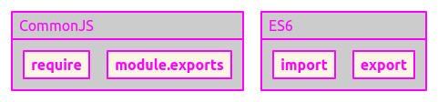

## asset import vs src

```javascript
// 1.import
import logo from "./logo.jpeg";


// 2.require
const logo = require("./logo.jpeg");


```

### 문대디님의 의견

(실명을 거론해도 좋을지 모르겠어서 닉네임만 언급했습니다.)

> `import`로 asset을 import하는 건 webpack을 품은 **react-script가 번들링** 해주는겁니다.
> img `src`로 불러오는건 dom에서 img 태그를 **리액트가 그려서** api든 origin에 request해서 그려주는거구요.
> 내 서버에 에셋을 품을거면 첫번째, 원격 origin에서 불러올 이미지면 두번째가 나을 거 같아요.



- `require은` **CommonJS문법**이고 `import는` **ES6문법**으로, 자바스크립트 엔진이 지원하지 않는 브라우저는 import syntax를 사용해도 babel을 통해서 require로 전환된다.
- `require` 키워드를 사용하면 런타임 중 코드에서 필요한 시점에 의존성 모듈을 로드(동적 로드)한다.
- `require` 키워드는 동기식으로 로딩하기 때문에 require을 여러개 사용하면, 하나 하나씩 처리 된다(블로킹 문제와 속도가 느림).
- `import` 키워드를 사용하면 import된 modules은 우선-파싱 되어 처음에 실행되지만 파일 안에 있는 코드는 나중에 실행된다.
- `import` 키워드는 비동기식으로 로딩하기 때문에 빠르게 처리 할 수 있다(논블로킹)

## 모듈 정의하기

### ES6

`export`에는 **named exports**와 **default exports** 두가지가 있다

- **named exports**: 모듈 하나에서 하나만 내보낼 때 사용
- **default exports**: 모듈 하나에서 여러개 내보낼 때 사용

```javascript
// 모듈에서 하나를 export, 파일내 한번만 사용가능하다.
export default function() {}
export default class {}

// 모든 속성을 export
export *;

// 모듈에서 여러개를 export
export function moduleFunc() {};
var property = "some property";
export { property };

// 모듈 전체를 import
import "my-module.js";
import myModule from "my-module.js";

// 모든 속성 import
import * as myModule from "my-module.js";

// 특정 멤버만 import
import { myMember } from "my-module.js";
import { reallyReallyLongModuleMemberName as shortName } from "my-module.js";

```

### CommonJs

```javascript
// 모듈 전체를 export
module.exports = module

// 함수를 직접 export
exports.moduleFunc = function() {}
모듈 가져오기 (import)

// 모듈 전체를 import
var module = require('./someModule.js')

// 특정 멤버(함수 등)만 import, 위의 module을 이용한다.
module.moduleFunc
```

## Reference

- [stack overflow: How do I reference a local image in React?](https://stackoverflow.com/questions/39999367/how-do-i-reference-a-local-image-in-react/39999421#39999421)
- [The difference between “require(x)” and import x](https://stackoverflow.com/questions/46677752/the-difference-between-requirex-and-import-x/46677972)
- [Webpack(웹팩) Import vs Require 차이점은 무엇일까?](https://medium.com/@shlee1353/webpack-%EC%9B%B9%ED%8C%A9-import-vs-require-%EC%B0%A8%EC%9D%B4%EC%A0%90%EC%9D%80-%EB%AC%B4%EC%97%87%EC%9D%BC%EA%B9%8C-17948f6c919e)
- [ES6 Modules in Chrome M61+](https://medium.com/dev-channel/es6-modules-in-chrome-canary-m60-ba588dfb8ab7)
- [MDN export](https://developer.mozilla.org/ko/docs/Web/JavaScript/Reference/Statements/export)
- [MDN import](https://developer.mozilla.org/ko/docs/Web/JavaScript/Reference/Statements)
