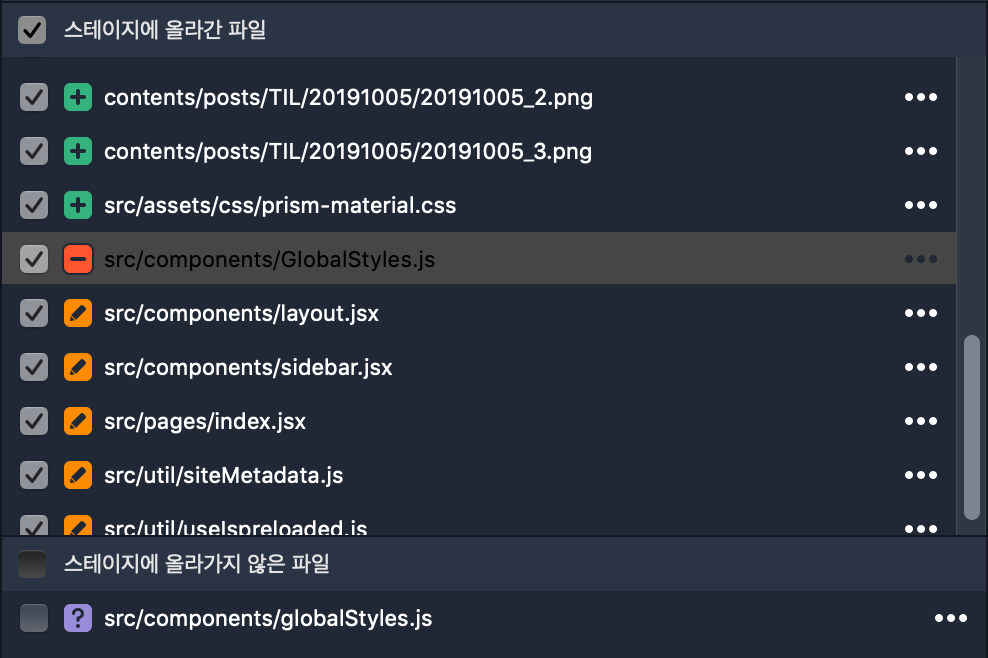

## error #98123 WEBPACK(Netlify Deploy failed)

파일명이 대부분은 소문자로 되어 있는데 한 개의 파일만 대문자로 되어있어 통일 하려다가 local에서는 잘 작동하나 netlify에 deploy시 아래와 같이 deploy가 되지않는 문제가 발생했다.

```
error #98123 WEBPACK
Generating JavaScript bundles failed
Can't resolve './globalStyles' in '/opt/build/repo/src/components'
```


import 시 설정한 경로문제로 생각하고, 경로만 바꿔서 다시 deploy 했으나 error 발생했다.

```
error #98123 WEBPACK
failed during stage 'building site': Build script returned non-zero exit code: 1
Generating JavaScript bundles failed
Can't resolve 'components/globalStyles' in '/opt/build/repo/src/components'
```

이후에도 1) node_modules을 삭제하고 다시 설치, 2) package-lock.json 파일 삭제하고 재생성, 3) .cache 폴더삭제, 4) Netlify cache clean 방법으로 다시 deploy 시도 했으나 여전히 같은 문제 발생했다.


### 문제 원인과 해결법

- 원인: 실제 파일명과 코드내에서 작성한 파일명이 일치하지 않아 번들링하지 못했다.
- 파일명은 `globalStyles` 이였으나 import 파일명은 `GlobalStyles`으로 작성했다.
- 현재 `gatsby-plugin-resolve-src` 라이브러리를 사용하고 있어, import시에 파일 경로명을 상대 경로 사용하지 않고 있었다.
- 해결법: 실제 파일명과 코드내에서 작성한 파일명 일치 시켜줬다.
- local에 node_modules/.cache에서 이전 파일명을 기억하고 있는 경우가 있으므로 확인하자!


+) 추가로 Sourcetree에서도 변경사항이 캐치되지 않아 파일을 삭제하고 새로 만들어줬다.


> 파일명을 수정할 때는 신중하게 수정하자! (특히 대소문자만 변경일 경우 꼼꼼히 살펴보자)
> 가능한 수정을 안하는게 좋겠지만, 이름을 정할때 `1.짧고, 2.다른사람이 봤을 때 의미 전달에 있어 오해의 소지가 없게, 3.항상 동일한 규칙으로 작성하자` 이 3가지 원칙을 중요하게 여기기 때문에 자꾸 변경하게 된다.
